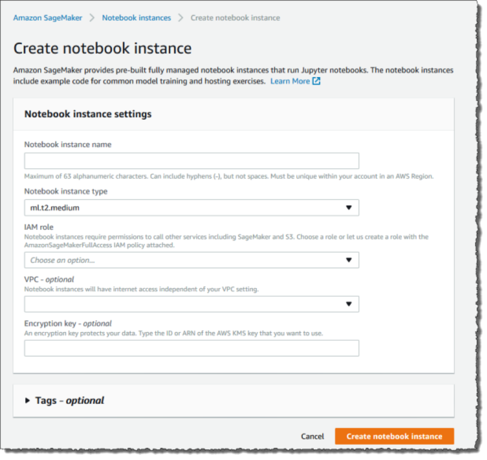
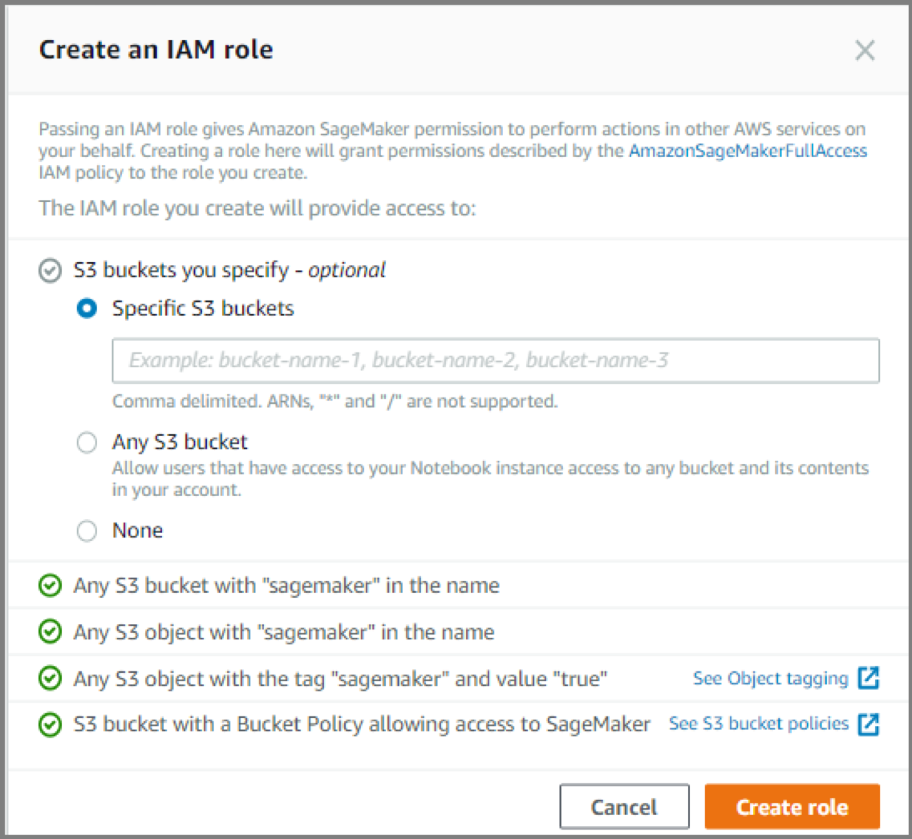
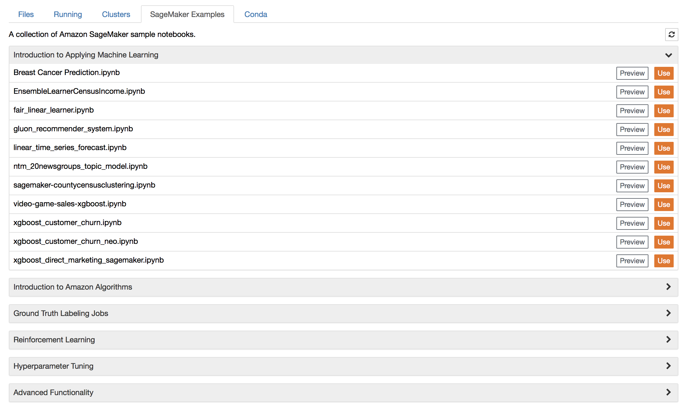

## Instructions to create SageMaker Notebook and upload sample notebooks

#### Step 1: Create SageMaker Notebook:

### To create an Amazon SageMaker notebook instance

1. Open the Amazon SageMaker console at https://console.aws.amazon.com/sagemaker/home?region=us-east-1

2. Choose Notebook instances, then choose Create notebook instance.



On the Create notebook instance page, provide the following information:
- For Notebook instance name, type SageMakerWorkshop.
- For Instance type, choose ml.p3.2xLarge.
- For IAM role, create an IAM role.
- Choose Create a new role.



To access more S3 buckets from your Amazon SageMaker notebook instance
- choose Any S3 bucket

Choose Create role.
Amazon SageMaker creates an IAM role named AmazonSageMaker-ExecutionRole-YYYYMMDDTHHmmSS. For example, AmazonSageMaker-ExecutionRole-20171125T090800.

3. Choose Create notebook instance.
In a few minutes, Amazon SageMaker launches an ML compute instance—in this case, a notebook instance—and attaches an ML storage volume to it. The notebook instance has a preconfigured Jupyter notebook server and a set of Anaconda libraries. For more information, see the CreateNotebookInstance API.

When the status of the notebook instance is InService, choose Open next to its name to open the Juypter dashboard.



The dashboard provides access to:

A new tab that contains sample notebooks. To use a sample notebook, on the "Sagemaker Examples" tab, choose the sample notebook you would like to explore. For information about the sample notebooks, see the Amazon SageMaker GitHub repository.
T.

### Step 2: To upload sample notebooks
Use the following steps to clone the following file in your already created notebook instance:
- Go to Jupyter
- New > Terminal

```
wget https://github.com/mahendrabairagi/ASU_Hackathon/blob/master/ASU_hackathon_train_mascot_model_resnet18.ipynb -P SageMaker/

wget https://github.com/mahendrabairagi/ASU_Hackathon/blob/master/ASU_hackathon_train_roadfollowing_model.ipynb -P SageMaker/

```
- Go to jupyter and open the newly downloaded ipynb notebook file by clicking 

"ASU_hackathon_train_mascot_model_resnet18.ipynb"

"ASU_hackathon_train_roadfollowing_model.ipynb"

### Step3: Using sample notebooks

To create new Road Following model, follow instruction on ASU_hackathon_train_roadfollowing_model notebook

To create new Mascot detection model, follow instruction on ASU_hackathon_train_mascot_model_resnet18 notebook


